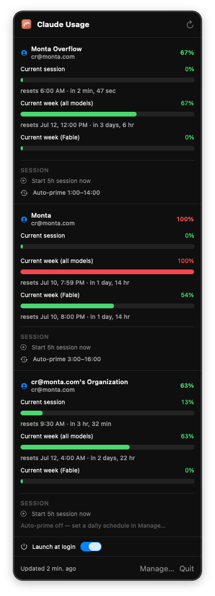

# Claude Usage

A tiny macOS menu-bar app that shows your **Claude Code plan usage** — one line per Max/Pro account, right next to the clock.

The menu bar shows each account's highest limit, e.g. `56% · 40%` (⚠︎ at 100%). See **[INSTALL.md](INSTALL.md)** for the quick start.

<p align="center">
  
</p>

---

## Install (fastest) — download the DMG

Grab the latest build, no compiler needed:

**→ [Download Claude-Usage.dmg](https://github.com/monta-app/claude-usage-mac-app/releases/latest/download/Claude-Usage.dmg)**

Open it, drag **Claude Usage** to Applications, launch it. It's ad-hoc signed, so the first launch is blocked by Gatekeeper — **right-click the app → Open → Open** (once). Then it self-adds to Login Items so it's always there after a reboot.

The DMG is rebuilt automatically from `main` on every push. The app checks GitHub for newer builds on launch and every 12h; a notification appears when an update is available. You can also check manually: **menu → Check for Updates…**.

---

## Install from source (2 minutes)

You need [Claude Code](https://claude.com/claude-code) installed and logged in, plus Xcode command-line tools (`xcode-select --install`).

```bash
git clone git@github.com:monta-app/claude-usage-mac-app.git
cd claude-usage-mac-app
./build-app.sh
open "Claude Usage.app"
```

That's it — look for the usage number in your menu bar. To keep it there after reboot: **System Settings → General → Login Items → +** → add `Claude Usage.app`.

To install it into Applications: `cp -R "Claude Usage.app" /Applications/`.

---

## What it shows

- **Claude Code plan limits** for the account you're logged into Claude Code as — session (5h) and weekly windows, as % bars. This is read from the CLI's own `claude -p "/usage"`, so **no setup** is needed for your primary account.
- The menu bar shows each account's **peak** usage (e.g. `56% · 40%`), turning red / ⚠︎ at 100%.

---

## Multiple accounts (both logged in at once)

See usage for several Claude accounts simultaneously — safely, with no Keychain access.

1. **Manage… → Add another account** → name it.
2. Click **Log in** on it → a Terminal runs `claude /login` in that account's own config dir → sign in as that account.
3. Both accounts now show in the dropdown, each with its own bars; the menu bar shows both peaks (e.g. `56% · 40%`).

Each extra account lives in its own `CLAUDE_CONFIG_DIR`, so it's an independent login that **never touches your Default login or the Keychain**. Your **Default** account is the one Claude Code and Conductor use.

**To make Claude Code / Conductor use an extra account** in a given terminal or Conductor session, set its `CLAUDE_CONFIG_DIR` to that account's dir (shown by the app). The Default account needs no env var.

## How it works

Reads plan limits via `claude -p "/usage"` (per config dir) and the account name via `claude auth status`. The app only reads usage and opens the official `claude /login` — it never touches the Keychain, stores no tokens, and never modifies a login. Refresh every 5 min or ↻.

Accounts (index + per-account logins) live under `~/.claude-usage/`, so the menu-bar app and the `ccu` CLI (below) share the same set of accounts.

---

## `ccu` — the CLI (SSH / headless workflows)

The same logic is also exposed as a CLI, `ccu`, in this repo. It's designed for the case where the menu-bar app can't run — a remote Mac mini over SSH, a CI box, a build server — and gives you the same multi-account model with **no Keychain, no GUI**.

### Build & install

```bash
./install-cli.sh                        # builds + installs to ~/.local/bin/ccu
./install-cli.sh --prefix /usr/local    # custom location
./install-cli.sh --prefix ~/apps       # ~/apps, per CLAUDE.md
```

Or download the prebuilt binary from the latest release (no compiler needed):

```bash
curl -fsSL https://github.com/monta-app/claude-usage-mac-app/releases/latest/download/ccu.tar.gz | tar xz -C ~/.local/bin
chmod +x ~/.local/bin/ccu
```

### Update

```bash
ccu update          # checks GitHub, downloads + atomically replaces this binary
ccu update --dry-run
```

`ccu update` compares the git SHA this binary was built from against the rolling `latest` release's commit, and only replaces when they differ. Works over SSH, no `brew`/`jq` needed.

### Add your accounts (over SSH)

Each account is its own `CLAUDE_CONFIG_DIR` with its own `.credentials.json`. `claude /login` prints a URL you open in a local browser — no Keychain involved:

```bash
ccu login work     # creates the account if missing, then runs `claude /login` in its dir
ccu login personal
ccu login team
```

### See usage

```bash
ccu list                   # all accounts, with ASCII usage bars
ccu usage work             # just one
```

Example output:
```
work · you@example.com
  Current session           56% ████████████░░░░░░░░  resets 3:00 PM
  Current week (all models) 40% ████████░░░░░░░░░░░░░  resets Jul 19, 5:00 PM
  schedule: auto-prime 8:00–17:00 · weekdays
```

### Use an account in this shell

```bash
eval "$(ccu env work)"     # exports CLAUDE_CONFIG_DIR for this shell
claude --resume             # continues a session under that account's config dir
ccu env work --unset | eval "$(cat)"   # to clear it again
```

Or run a single command under an account without touching your shell:

```bash
ccu use work -- claude --resume
ccu use personal -- claude -p "/usage"
```

Sessions are stored per `CLAUDE_CONFIG_DIR` (`<dir>/projects/<hash>/<session-id>.jsonl`), so switching accounts with `ccu env` never deletes or migrates sessions — `claude --resume` lists the ones in the active account's dir.

### Keep tokens fresh (cron)

`ccu` refreshes tokens as a side-effect of `usage`/`list`, but if an account sits idle for hours it can expire. Cron it:

```bash
# every 30 min, refresh all tokens
*/30 * * * * /usr/local/bin/ccu refresh >> ~/.claude-usage/refresh.log 2>&1
```

### Auto-prime the 5h window on a schedule (cron)

The menu-bar app can auto-prime the 5h session window on a daily schedule. The CLI exposes the same logic via `ccu run`, which you drive from cron once a minute:

```bash
ccu schedule work --start 8:00 --hours 9      # auto-prime 8:00–17:00, weekdays only
ccu schedule work --all-week                  # every day instead
ccu schedule work                             # disable the schedule

# drive it (cron, every minute):
* * * * * /usr/local/bin/ccu run >> ~/.claude-usage/ccu-run.log 2>&1
```

`ccu run` is idempotent and cheap: it fetches current usage, and for any scheduled account inside its active window that has no 5h block running, sends one tiny message to start one. Does nothing when the account is already active (your own messages keep the block alive).

### All commands

```
ccu list                 list accounts + usage bars
ccu add <name>           create an empty account slot
ccu login <name>         run `claude /login` for an account (SSH-friendly)
ccu usage [name]         show usage bars for one (or all) accounts
ccu refresh [name]       refresh OAuth tokens (cron-able)
ccu prime <name>         start the 5h session window now
ccu env <name>           print `export CLAUDE_CONFIG_DIR=...` (for eval)
ccu use <name> -- <cmd>  run a command with CLAUDE_CONFIG_DIR set
ccu rename <name> <new>  rename an account
ccu rm <name>            delete an account and its login dir
ccu schedule <name> …    set / disable the daily auto-prime schedule
ccu run                  one scheduler tick (cron-able)
ccu update               check GitHub for a newer binary and self-replace
```

Accounts live under `~/.claude-usage/cc/<uuid>/.credentials.json`; the index is `~/.claude-usage/accounts.json`. Sync that dir across machines (dotfiles, syncthing, …) to keep accounts consistent.

---

## Disclaimer

This is an **unofficial**, community-built tool. It is **not affiliated with, endorsed by, or sponsored by Anthropic**. "Claude", "Claude Code", and "Anthropic" are trademarks of Anthropic PBC and are used here only descriptively to indicate what the app reads. The app talks solely to your locally installed Claude Code CLI and Anthropic's own OAuth/usage endpoints on your behalf.

## License

[MIT](LICENSE) © Casper Rasmussen. Provided "as is", without warranty of any kind.
